# Advance Lane Lines Finding Project

## Goals

The goals/steps of this project are the following:

- Compute the camera calibration matrix and distortion coefficients given a set of chessboard images.
- Apply a distortion correction to raw images.
- Use color transforms, gradients, etc., to create a thresholded binary image.
- Apply a perspective transform to rectify binary image ("birds-eye view").
- Detect lane pixels and fit to find the lane boundary.
- Determine the curvature of the lane and vehicle position on center.
- Warp the detected lane boundaries back onto the original image.
- Output visual display of the lane boundaries and numerical estimation of lane curvature and vehicle position.

## [Rubric](https://review.udacity.com/#!/rubrics/571/view) points

### Writeup / README

#### 1. Provide a Writeup / README that includes all the rubric points and how you addressed each one. You can submit your writeup as markdown or pdf. [Here](https://github.com/udacity/CarND-Advanced-Lane-Lines/blob/master/writeup_template.md) is a template writeup for this project you can use as a guide and a starting point.

You're reading it!

### Camera calibration

#### 1. Briefly, state how you computed the camera matrix and distortion coefficients. Provide an example of a distortion corrected calibration image.

The camera calibration code could be found on the first code shell [Advance_Lane_Find notebook](Advance_Lane_Find.ipynb). Using `cv2.findChessboardCorners`, the corners points are stored in an array `imgpoints` for each calibration image where the chessboard could be found. The object points will always be the same as the known coordinates of the chessboard with zero as 'z' coordinate because the chessboard is flat. The object points are stored in an array called `objpoints`. I then used the output objpoints and imgpoints to compute the camera calibration and distortion coefficients using the `cv2.calibrateCamera` function.

The image below depicts the rsults of applying `cv2.undistort`, using the calibration and distortion coefficients, to one of the chessboar images:

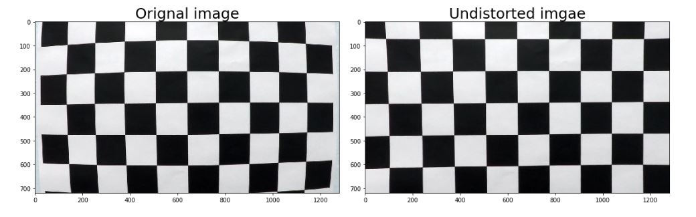

The camera calibration and distortion coefficients are stored on file [Camera calibration coefficients.p](camera_calibrate_coefficients.p) using `pickle` to be used on the main [notebook](Advance_Lane_Find.ipynb)

### Pipeline (single images)


#### 1. Provide an example of a distortion-corrected image.

The following image shows the result of applying the camera calibration to one of the test images:

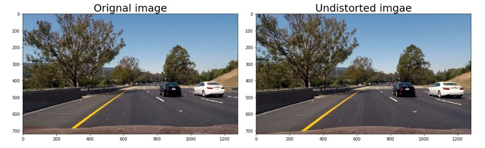

As seen from images, the effect of `cv2.undistort` is subtle, but can be perceived from the difference in shape of the hood of the car at the bottom coeners of the image.

#### 2. Describe how (and identify where in your code) you used color transforms, gradients or other methods to create a thresholded binary image. Provide an example of a binary image result.

The code used to experiment with color, gradients, and thresholds could be found on the [Advance_Lane_Find notebook](Advance_Lane_Find.ipynb).

I explore several combinations of sobel gradient thresholds and color channel thresholds in mutiple coloe spaces. Below is the demonstration of applying different thresholds and combination of sobel, direction, and mutiple color spaces for the same image: 

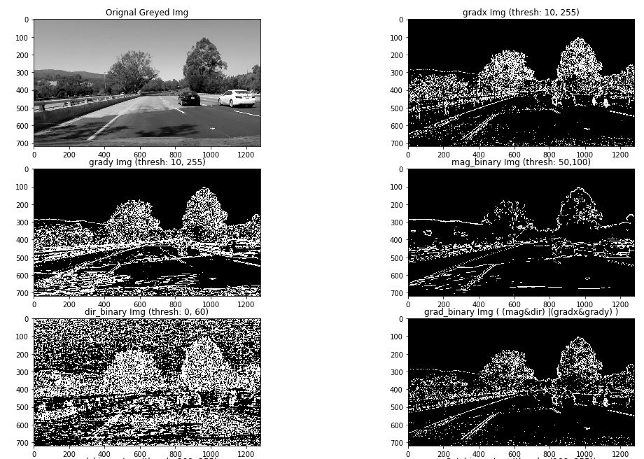
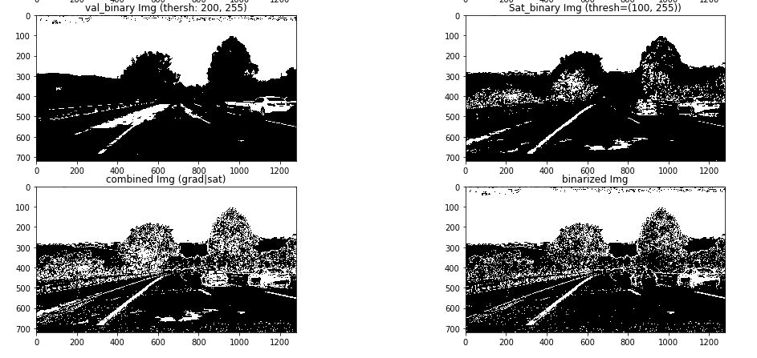

Ultimately, I chosed the following :

- Sobel X and Sobel Y: 
- Magnitude : 
- Gradient direction 
- S-channel of HLS
- V-channel of HSV
- Combination of all the above (Sobel X and Sobel Y) or (Magnitude and Gradient)

The full combination of these gradients leads to a 'noisy' image as shown in below:

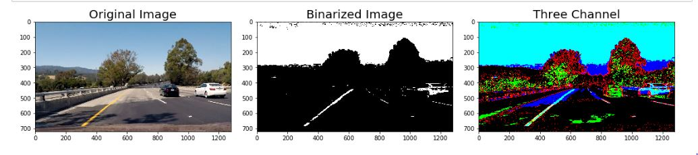

On the [Advance_Lane_Find notebook](Advance_Lane_Find.ipynb), all the code could be found from the cell [4] just below `Step 2： Use color transforms, gradients, etc, to create a thresholded binary image`

#### 3. Describe how (and identify where in your code) you performed a perspective transform and provided an example of a transformed image.

The code for my perspective transform is titled as` Step 3: Apply a perspective transform to rectify binary image ` in the Jupyter notebook.  The ` bird_eye_view ` function takes as inputs an image (`img`), as well as source (`src`) and destination (`dst`) points.  I chose to hardcode the source and destination points in the following manner:

```
offset = 250
corners = np.float32([[190,720],[600,447],[685,447],[1125,720]])
src = corners

dst = np.float32([[corners[0][0] + offset, corners[0][1]],
                      [corners[0][0] + offset, 0],
                      [corners[3][0] - offset, 0],
                      [corners[3][0] - offset, corners[3][1]]])   

```

Using `cv2.getPerspectiveTransform`, a transformation matrix was calculated, and an inverse transformation matrix was also calculated to map the points back to the original space . Four points where selected on the first image as the source of the perspective transformation. Those points are highlighted on the following image, after transformation, the result of the transformation on a test image is the following as well:

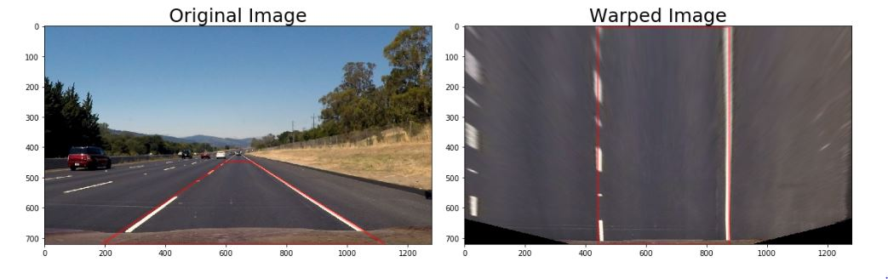

The transformation matrix and the inverse transformation matrix was stored using `pickle` to be used on the main notebook [Advanced Lane Lines notebook](Advance_Lane_Find.ipynb). The following picture shows the binary images results after the perspective transformation:

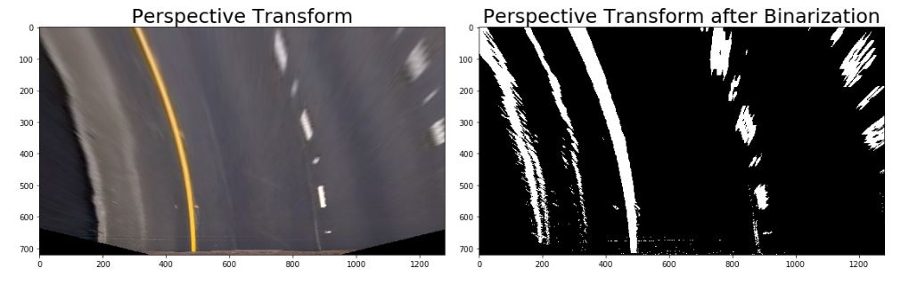

#### 4. Describe how (and identify where in your code) you identified lane-line pixels and fit their positions with a polynomial?

The codes, which are used to identify lane-line, sit in the cell [75] on the main notebook [Advanced Lane Lines notebook](Advance_Lane_Find.ipynb). Within this cell all the functions are clearly labeled.The first of these computes a histogram of the bottom half of the image and finds the bottom-most x position (or "base") of the left and right lane lines. Originally these locations were identified from the local maxima of the left and right halves of the histogram, but in my final implementation I changed these to quarters of the histogram just left and right of the midpoint. This helped to reject lines from adjacent lanes. The function then identifies ten windows from which to identify lane pixels, each one centered on the midpoint of the pixels from the window below. This effectively "follows" the lane lines up to the top of the binary image, and speeds processing by only searching for activated pixels over a small portion of the image. Pixels belonging to each lane line are identified and the Numpy polyfit() method fits a second order polynomial to each set of pixels. The image below demonstrates how this process works:

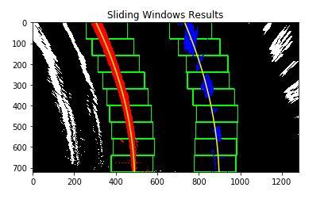

The imgae below depicts the histogram generated in the cell [9] on the main notebook [Advanced Lane Lines notebook](Advance_Lane_Find.ipynb), the resulting base points for the left and right lanes - the two peaks nearst the center - are clearly visible:

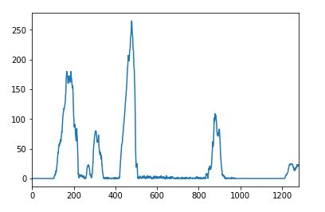

It is a challange work to use previous information for performing basically the same task, but alleviates much difficulty of the search process by leveraging a previous fit (from a previous video frame, for example) and only searching for lane pixels within a certain range of that fit. The image below demonstrates this - the green shaded area is the range from the previous fit, and the yellow lines and red and blue pixels are from the current image:

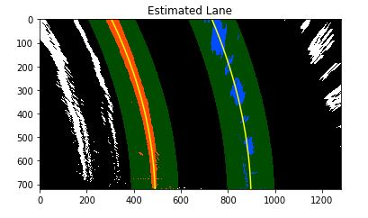

#### 5. Describe how (and identify where in your code) you calculated the radius of curvature of the lane and the position of the vehicle on the center.

The code used to calculate this could be found staring from cell [11] to cell [14] [Advanced Lane Lines notebook](Advance_Lane_Find.ipynb)
To calculate the curvature. The formula is the following:

```
# Calculate the new radii of curvature
left_curverad = ((1 + (2*left_fit_cr[0]*y_eval*ym_per_pix + left_fit_cr[1])**2)**1.5) / np.absolute(2*left_fit_cr[0])
right_curverad = ((1 + (2*right_fit_cr[0]*y_eval*ym_per_pix + right_fit_cr[1])**2)**1.5) / np.absolute(2*right_fit_cr[0])
```

In this example, xx_fit_cr[0] is the first coefficient (the y-squared coefficient) of the second order polynomial fit, and XXX_fit_cr[1] is the second (y) coefficient. y_eval the y position within the image upon which the curvature calculation is based (the bottom-most y - the position of the car in the image - was chosen). ym_per_pix is the factor used for converting from pixels to meters. This conversion was also used to generate a new fit with coefficients in terms of meters.

To find the vehicle position on the center:

- Calculate the lane center by evaluating the left and right polynomials at the maximum Y and find the middle point.
- Calculate the vehicle center transforming the center of the image from pixels to meters.
- The sign between the distance between the lane center and the vehicle center gives if the vehicle is on to the left or the right.

The code used to calculate this is show as below:

```
lane_center = (left_fitx + right_fitx) / 2
lane_offset = (car_position - lane_center[-1]) * xm_per_pix
print("Distance from Center of Lane {:.3f} m".format(lane_offset))
```

#### 6. Provide an example image of your result plotted back down onto the road such that the lane area is identified clearly.

To display the lane lines on the image, the polynomials where evaluated on a lineal space of the Y coordinates. The generated points where mapped back to the image space using the inverse transformation matrix generated by the perspective transformation.  the following images are examples of this mapping:

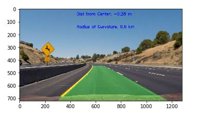


### Pipeline (video)

#### 1. Provide a link to your final video output. Your pipeline should perform reasonably well on the entire project video (wobbly lines are ok but no catastrophic failures that would cause the car to drive off the road!).

The project video was processed and the results at [video_output](./misc/project_video_output_bk.mp4)

### Discussion

#### 1. Briefly, discuss any problems/issues you faced in your implementation of this project. Where will your pipeline likely fail? What could you do to make it more robust?

At the beginning my pipeline did not perform well on the original project video due to lighting conditions, shadows, discoloration,  etc. 

It could become an issue for my pipeline under snow or in a situation where, for example, a bright white car were driving among dull white lane lines. 

The following possible approaches could make my alorithm more robust:

- including dynamic thresholding;
- More information could be use from frame to frame to improve the robustness of the process;
- designating a confidence level for fits and rejecting new fits that deviate beyond a certain amount.

